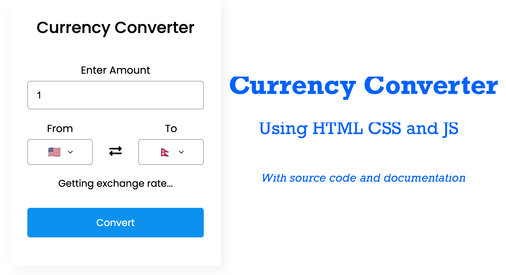

---
styles:
  - ../style.css
---

# Currency Converter



### Live demo
Visit [https://satyamregmi.com.np/projects/currency-converter/](https://satyamregmi.com.np/projects/currency-converter/) ↗️

Hello there, today in this blog, I'll guide you through creating a Currency Converter App using HTML, CSS, and JavaScript.
In this app, you can enter an amount and convert it to another country's currency. The amount field cannot be left blank or set to zero; if empty, it defaults to "1". Additionally, you can quickly swap between two currencies by clicking on the exchange icon.
Feel free to adjust it further to fit the style and tone of your blog!

Before you copy paste code, let`s understand the main code and concepts behind creating this project.

## Codes & Concepts Behind Currency Converter:
In the country-list.js file, I've organized all possible country codes and their corresponding currency codes as an object. This makes it easy to reference and manage currency data throughout the application.

In the script.js file, the implementation begins by dynamically populating the currency options in the user interface. This is achieved by iterating through the countryCurrencyMap object and creating `<option>` tags for each currency code, which are then appended to the `<select>` element.

Next, the core functionality involves fetching exchange rates from an external API based on the user-selected 'from' currency code. Upon receiving the rates, the application retrieves the conversion rate for the user-selected 'to' currency. Using this rate, it calculates the converted amount based on the user-entered initial amount and displays it in the UI.

## API
You can get this key from the official [ExchageRateAPI](https://www.exchangerate-api.com/) site for free. You can also use any other site API for this project. If you do so then you have to modify the JavaScript codes accordingly. I recommend using the same api site for this project.

## Create index.html

```html filename="index.html" copy {style="height: 100px; overflow:auto;"}
<!DOCTYPE html>
<!-- Code By SATYAM -->
<html lang="en" dir="ltr">
  <head>
    <meta charset="utf-8">
    <title>Currency Converter | SATYAM</title>
    <meta name="viewport" content="width=device-width, initial-scale=1.0">
    <link rel="shortcut icon" href="https://satyamregmi.com.np/images/lion-logo.png" type="image/x-icon">
    <!-- Open Graph Meta Tags for Facebook -->
    <meta property="og:title" content="Currency Converter | SATYAM">
    <meta property="og:description" content="Currency Converter by SATYAM">
    <meta property="og:image" content="https://satyamregmi.com.np/images/lion-logo.png">
    <meta property="og:url" content="https://satyamregmi.com.np/">

    <!-- Twitter Card Meta Tags -->
    <meta name="twitter:card" content="summary_large_image">
    <meta name="twitter:title" content="Currency Converter | SATYAM">
    <meta name="twitter:description" content="Currency COnverter">
    <meta name="twitter:image" content="https://satyamregmi.com.np/images/lion-logo.png">
    <meta name="twitter:creator" content="@SatyamRegmiX">

    <!-- Other Meta Tags for SEO -->
    <meta name="description" content="Currency Converter">
    <meta name="keywords" content="Currency, converter, SATYAM, PDF generator">
    <meta name="author" content="SATYAM REGMI">

    <!-- Font Awesome Icons -->
    <link rel="stylesheet" href="https://cdnjs.cloudflare.com/ajax/libs/font-awesome/5.15.3/css/all.min.css">

    <!-- Stylesheet -->
    <link rel="stylesheet" href="style.css">
    <link rel="stylesheet" href="https://cdnjs.cloudflare.com/ajax/libs/font-awesome/5.15.3/css/all.min.css"/>
    <script src="https://cdnjs.cloudflare.com/ajax/libs/jquery/3.7.1/jquery.min.js"
    integrity="sha512-v2CJ7UaYy4JwqLDIrZUI/4hqeoQieOmAZNXBeQyjo21dadnwR+8ZaIJVT8EE2iyI61OV8e6M8PP2/4hpQINQ/g=="
    crossorigin="anonymous" referrerpolicy="no-referrer"></script>
  </head>
  <body>
  <custombody>
    <div class="wrapper">
      <header>Currency Converter</header>
      <form action="#">
        <div class="amount">
          <p>Enter Amount</p>
          <input type="text" value="1">
        </div>
        <div class="drop-list">
          <div class="from">
            <p>From</p>
            <div class="select-box">
              
              <select> <!-- Options are inserted from JavaScript --> </select>
            </div>
          </div>
          <div class="icon"><i class="fas fa-exchange-alt"></i></div>
          <div class="to">
            <p>To</p>
            <div class="select-box">
              
              <select> <!-- Options are inserted from JavaScript --> </select>
            </div>
          </div>
        </div>
        <div class="exchange-rate">Getting exchange rate...</div>
        <button>Convert</button>
      </form>
    </div>
  </custombody>
    <!--Script-->
    <script src="/country-list.js"></script>
    <script src="/script.js"></script>
  </body>
  <footer class = "footer">
    <div class="ft-container">
        <div class = "footer-content text-center">
            <p class="fs-15">&copy;Copyright 2024. All Rights Reserved - <span><a href="https://satyamregmi.com.np">SATYAM REGMI</a></span></p>
        </div>
    </div>
</footer>
</html>
```

## Create style.css

```css filename="style.css" copy
/*Google Font - Poppins */
@import url('https://fonts.googleapis.com/css2?family=Poppins:wght@400;500;600;700&display=swap');
*{
  margin: 0;
  padding: 0;
  box-sizing: border-box;
  font-family: 'Poppins', sans-serif;
}
custombody{
  display: flex;
  align-items: center;
  justify-content: center;
  min-height: 100vh;
  padding: 0 10px;
  background: #006efd;
  gap: 20px;
}
::selection{
  color: #fff;
  background: #006efd;
}
a:-webkit-any(:link){
  text-decoration: none;
  color: #006efd;
}
.wrapper{
  width: 370px;
  padding: 30px;
  border-radius: 7px;
  margin-top: 20px;
  background: #fff;
  box-shadow: 7px 7px 20px rgba(0, 0, 0, 0.05);
}
.wrapper-2{
  width: 370px;
  height: 520px;
  border-radius: 7px;
  background: #fff;
  padding: 5px;
  margin-bottom: 20px;
  box-shadow: 7px 7px 20px rgba(0, 0, 0, 0.05);
  overflow: hidden;
  overflow-y: scroll;
}
.wrapper-2 header{
  font-size: 28px;
  font-weight: 500;
  text-align: center;
}

.wrapper header{
  font-size: 28px;
  font-weight: 500;
  text-align: center;
}
.wrapper form{
  margin: 40px 0 20px 0;
}
form :where(input, select, button){
  width: 100%;
  outline: none;
  border-radius: 5px;
  border: none;
}
form p{
  font-size: 18px;
  margin-bottom: 5px;
}
form input{
  height: 50px;
  font-size: 17px;
  padding: 0 15px;
  border: 1px solid #999;
}
form input:focus{
  padding: 0 14px;
  border: 2px solid #006efd;
}
form .drop-list{
  display: flex;
  margin-top: 20px;
  align-items: center;
  justify-content: space-between;
}
.drop-list .select-box{
  display: flex;
  width: 115px;
  height: 45px;
  align-items: center;
  border-radius: 5px;
  justify-content: center;
  border: 1px solid #999;
}
.select-box img{
  max-width: 21px;
}
.select-box select{
  width: auto;
  font-size: 16px;
  background: none;
  margin: 0 -5px 0 5px;
}
.select-box select::-webkit-scrollbar{
  width: 8px;
}
.select-box select::-webkit-scrollbar-track{
  background: #fff;
}
.select-box select::-webkit-scrollbar-thumb{
  background: #888;
  border-radius: 8px;
  border-right: 2px solid #ffffff;
}
.drop-list .icon{
  cursor: pointer;
  margin-top: 30px;
  font-size: 22px;
}
form .exchange-rate{
  font-size: 17px;
  margin: 20px 0 30px;
}
form button{
  height: 52px;
  color: #fff;
  font-size: 17px;
  cursor: pointer;
  background: #006efd;
  transition: 0.3s ease;
}
form button:hover{
  background: #004cfd;
}
/* footer */
.footer{
  padding: 3rem 0;
  bottom: 0%;
  
}
.ft-container{
  margin: auto;
  align-items: center;
  text-align: center;
  
}
.footer-content p{
  color: var(--clr-grey);
}
.footer-content p span{
  color: var(--clr-white);
}
.bg-dark{
  background-color:black;
}

@media only screen and (max-width: 887px) {
  custombody{
    display: flex;
    flex-direction: column;
  }
}
```


## Create script.js

Remember to copy and paste your [API](#api) Key below:

```js filename="script.js" copy {.custom-code-block}
let apiKey = 'your API Key Here. Read how to implement API Key Above'; ////** API KEY HERE **////
//   Main

const dropList = document.querySelectorAll("form select"),
fromCurrency = document.querySelector(".from select"),
toCurrency = document.querySelector(".to select"),
getButton = document.querySelector("form button");

for (let i = 0; i < dropList.length; i++) {
    for(let currency_code in country_list){
        let selected = i == 0 ? currency_code == "USD" ? "selected" : "" : currency_code == "NPR" ? "selected" : "";
        let optionTag = `<option value="${currency_code}" ${selected}>${currency_code}</option>`;
        dropList[i].insertAdjacentHTML("beforeend", optionTag);
    }
    dropList[i].addEventListener("change", e =>{
        loadFlag(e.target);
    });
}

function loadFlag(element){
    for(let code in country_list){
        if(code == element.value){
            let imgTag = element.parentElement.querySelector("img");
            imgTag.src = `https://flagcdn.com/48x36/${country_list[code].toLowerCase()}.png`;
        }
    }
}

window.addEventListener("load", ()=>{
    getExchangeRate();
});

getButton.addEventListener("click", e =>{
    e.preventDefault();
    getExchangeRate();
});

const exchangeIcon = document.querySelector("form .icon");
exchangeIcon.addEventListener("click", ()=>{
    let tempCode = fromCurrency.value;
    fromCurrency.value = toCurrency.value;
    toCurrency.value = tempCode;
    loadFlag(fromCurrency);
    loadFlag(toCurrency);
    getExchangeRate();
})

function getExchangeRate(){
    const amount = document.querySelector("form input");
    const exchangeRateTxt = document.querySelector("form .exchange-rate");
    let amountVal = amount.value;
    if(amountVal == "" || amountVal == "0"){
        amount.value = "1";
        amountVal = 1;
    }
    exchangeRateTxt.innerText = "Getting exchange rate...";
    let url = `https://v6.exchangerate-api.com/v6/${apiKey}/latest/${fromCurrency.value}`;
    fetch(url).then(response => response.json()).then(result =>{
        let exchangeRate = result.conversion_rates[toCurrency.value];
        let totalExRate = (amountVal * exchangeRate).toFixed(2);
        exchangeRateTxt.innerText = `${amountVal} ${fromCurrency.value} = ${totalExRate} ${toCurrency.value}`;
    }).catch(() =>{
        exchangeRateTxt.innerText = "Something went wrong! Check Your Internet Connection.";
    });
}
```

## Create country-list.js

```js filename="country-list.js" copy
let country_list = {
    "AED" : "AE",
    "AFN" : "AF",
    "XCD" : "AG",
    "ALL" : "AL",
    "AMD" : "AM",
    "ANG" : "AN",
    "AOA" : "AO",
    "AQD" : "AQ",
    "ARS" : "AR",
    "AUD" : "AU",
    "AZN" : "AZ",
    "BAM" : "BA",
    "BBD" : "BB",
    "BDT" : "BD",
    "XOF" : "BE",
    "BGN" : "BG",
    "BHD" : "BH",
    "BIF" : "BI",
    "BMD" : "BM",
    "BND" : "BN",
    "BOB" : "BO",
    "BRL" : "BR",
    "BSD" : "BS",
    "NOK" : "BV",
    "BWP" : "BW",
    "BYR" : "BY",
    "BZD" : "BZ",
    "CAD" : "CA",
    "CDF" : "CD",
    "XAF" : "CF",
    "CHF" : "CH",
    "CLP" : "CL",
    "CNY" : "CN",
    "COP" : "CO",
    "CRC" : "CR",
    "CUP" : "CU",
    "CVE" : "CV",
    "CYP" : "CY",
    "CZK" : "CZ",
    "DJF" : "DJ",
    "DKK" : "DK",
    "DOP" : "DO",
    "DZD" : "DZ",
    "ECS" : "EC",
    "EEK" : "EE",
    "EGP" : "EG",
    "ETB" : "ET",
    "EUR" : "FR",
    "FJD" : "FJ",
    "FKP" : "FK",
    "GBP" : "GB",
    "GEL" : "GE",
    "GGP" : "GG",
    "GHS" : "GH",
    "GIP" : "GI",
    "GMD" : "GM",
    "GNF" : "GN",
    "GTQ" : "GT",
    "GYD" : "GY",
    "HKD" : "HK",
    "HNL" : "HN",
    "HRK" : "HR",
    "HTG" : "HT",
    "HUF" : "HU",
    "IDR" : "ID",
    "ILS" : "IL",
    "INR" : "IN",
    "IQD" : "IQ",
    "IRR" : "IR",
    "ISK" : "IS",
    "JMD" : "JM",
    "JOD" : "JO",
    "JPY" : "JP",
    "KES" : "KE",
    "KGS" : "KG",
    "KHR" : "KH",
    "KMF" : "KM",
    "KPW" : "KP",
    "KRW" : "KR",
    "KWD" : "KW",
    "KYD" : "KY",
    "KZT" : "KZ",
    "LAK" : "LA",
    "LBP" : "LB",
    "LKR" : "LK",
    "LRD" : "LR",
    "LSL" : "LS",
    "LTL" : "LT",
    "LVL" : "LV",
    "LYD" : "LY",
    "MAD" : "MA",
    "MDL" : "MD",
    "MGA" : "MG",
    "MKD" : "MK",
    "MMK" : "MM",
    "MNT" : "MN",
    "MOP" : "MO",
    "MRO" : "MR",
    "MTL" : "MT",
    "MUR" : "MU",
    "MVR" : "MV",
    "MWK" : "MW",
    "MXN" : "MX",
    "MYR" : "MY",
    "MZN" : "MZ",
    "NAD" : "NA",
    "XPF" : "NC",
    "NGN" : "NG",
    "NIO" : "NI",
    "NPR" : "NP",
    "NZD" : "NZ",
    "OMR" : "OM",
    "PAB" : "PA",
    "PEN" : "PE",
    "PGK" : "PG",
    "PHP" : "PH",
    "PKR" : "PK",
    "PLN" : "PL",
    "PYG" : "PY",
    "QAR" : "QA",
    "RON" : "RO",
    "RSD" : "RS",
    "RUB" : "RU",
    "RWF" : "RW",
    "SAR" : "SA",
    "SBD" : "SB",
    "SCR" : "SC",
    "SDG" : "SD",
    "SEK" : "SE",
    "SGD" : "SG",
    "SKK" : "SK",
    "SLL" : "SL",
    "SOS" : "SO",
    "SRD" : "SR",
    "STD" : "ST",
    "SVC" : "SV",
    "SYP" : "SY",
    "SZL" : "SZ",
    "THB" : "TH",
    "TJS" : "TJ",
    "TMT" : "TM",
    "TND" : "TN",
    "TOP" : "TO",
    "TRY" : "TR",
    "TTD" : "TT",
    "TWD" : "TW",
    "TZS" : "TZ",
    "UAH" : "UA",
    "UGX" : "UG",
    "USD" : "US",
    "UYU" : "UY",
    "UZS" : "UZ",
    "VEF" : "VE",
    "VND" : "VN",
    "VUV" : "VU",
    "YER" : "YE",
    "ZAR" : "ZA",
    "ZMK" : "ZM",
    "ZWD" : "ZW"
}
```

